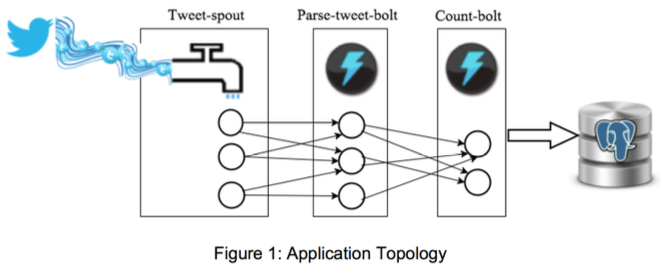

# Documentation for Exercise 2
## Collin Reinking

### Directory and File Structure
The critical files and directories are organized as shown below.
```
exercise_2
   |   finalresults.py
   |   histogram.py
   |--extweetwordcount
      |--src
      |  |--bolts
      |  |    parse.py
      |  |    wordcount.py
      |  |--spouts
      |       tweets.py
      |--topologies
           tweetwordcount.clj
```
### Application Idea
This application does a word count on the stream of tweets in the english language from Twitter.  It stores those word counts in a Postgres database which can be queried using the finalresults.py and hostogram.py scripts.
### Description of the Architecture
The data comes in from twitter and each tweet is passed to a parse bolt which separates each tweet into individual words, removes leading and tailing punctuation and converts all alphabetic characters to lower case.  Each word is then passed to a wordcount bolt which updates the the postgres database.



### Dependencies
Apache Storm
PosgresSQL
Python 2.7x
Python Libraries: psycopg2, streamparse, tweepy
